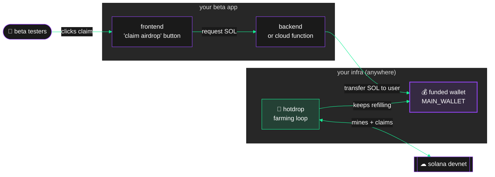

<div align="center">


# hotdrop

**Unstoppable devnet SOL for Solana teams running betas and integration tests.**

Claims from the on-chain proof-of-work faucet so your test users aren't blocked by rate limits, captchas, or GitHub account requirements.

</div>

---

> ### ⚠️ What this is for
>
> Your team is about to launch a **devnet beta** (a new protocol integration, an MPC circuit, an ephemeral rollup, a token launchpad) and you need your early users to actually use it. But `api.devnet.solana.com` is rate-limited and often dry, `faucet.solana.com` [caps at 2 requests every 8 hours](https://faucet.solana.com) with a GitHub sign-in requirement and an explicit *"AI agents should not use this faucet"* notice — and deploying a non-trivial Anchor program to devnet can burn [1–3 SOL depending on program size](https://solana.com/docs/programs/deploying) (more if a failed redeploy leaves [buffer accounts locked](https://solana.com/docs/programs/deploying#closing-program-accounts)). [Arcium's MXE deployment alone asks for 2–5 SOL up front](https://docs.arcium.com/developers/deployment), and MagicBlock ephemeral rollup programs pay standard Solana BPF loader rent on top of whatever your app needs.
>
> Sending every tester through the official faucet does not work. This tool farms devnet SOL via [Jarry Xiao's on-chain PoW faucet](https://github.com/jarry-xiao/proof-of-work-faucet) so **your team can fund its own distribution** — no rate limits, no accounts required, no humans in the loop.
>
> **This is a devnet utility for testing.** Do not point it at mainnet.

---

## Credit where it's due

The heavy lifting is done by a smart contract we did not write:

- **On-chain program:** [`jarry-xiao/proof-of-work-faucet`](https://github.com/jarry-xiao/proof-of-work-faucet) (program ID `PoWSNH2hEZogtCg1Zgm51FnkmJperzYDgPK4fvs8taL` on devnet)
- **Original author:** [Jarry Xiao](https://github.com/jarry-xiao) — Solana engineer, long-time contributor to [Phoenix](https://github.com/Ellipsis-Labs/phoenix-v1) at Ellipsis Labs
- **Reference CLI:** `cargo install devnet-pow` ([crate](https://crates.io/crates/devnet-pow)) — single-threaded Rust client with `create`, `mine`, and `get-all-faucets` commands

`hotdrop` is a TypeScript client on top of that program with opinionated choices for team-scale automation: parallel mining, a distribution API, proxy-friendly RPC, and a farming loop.

## How it works

```mermaid
%%{init: {'theme':'base','themeVariables':{'primaryColor':'#1a1a1a','primaryTextColor':'#fff','primaryBorderColor':'#9945FF','lineColor':'#14F195','secondaryColor':'#2a2a2a','tertiaryColor':'#1a1a1a'}}}%%
flowchart LR
    MW["🔑 main wallet<br/>(pays fees, receives SOL)"]

    subgraph HOTDROP ["your machine — hotdrop runner"]
        direction TB
        M1["⛏ miner #1<br/>grinding AAA..."]
        M2["⛏ miner #2<br/>grinding AAA..."]
        M3["⛏ miner #N<br/>grinding AAA..."]
    end

    PROXY{{"🌐 optional proxy<br/>rotates outbound IP"}}
    RPC[["☁ devnet RPC<br/>api.devnet.solana.com"]]
    PROG["📜 PoW program<br/>PoWSNH2...taL"]

    MW -->|signs airdrop tx| HOTDROP
    HOTDROP -->|signed tx| PROXY
    PROXY -->|JSON-RPC| RPC
    RPC -->|invoke| PROG
    PROG -->|transfer SOL| MW

    classDef wallet fill:#9945FF20,stroke:#9945FF,color:#fff,stroke-width:2px
    classDef miner fill:#14F19520,stroke:#14F195,color:#fff
    classDef chain fill:#1a1a1a,stroke:#666,color:#fff
    class MW wallet
    class M1,M2,M3 miner
    class RPC,PROG,PROXY chain
```



1. **Discover** — scan the PoW program on devnet for every faucet account that still has SOL to distribute (`hotdrop discover`)
2. **Mine** — in parallel, brute-force ed25519 keypairs whose base58 pubkey starts with N consecutive `A` characters (N = the faucet's difficulty)
3. **Claim** — submit a signed `airdrop` instruction where the vanity keypair co-signs; the on-chain program verifies the prefix and transfers SOL into your main wallet
4. **Distribute** — either pull SOL from the main wallet via the optional HTTP API, or transfer it yourself in whatever backend you already have

### Where `hotdrop` fits in your stack



The runner (`hotdrop farm`) is decoupled from your app — it just maintains a balance in a wallet you control. Your backend then distributes from that wallet using whatever logic you want (per-user caps, whitelists, rate limits, etc.). No coupling, no lock-in.

The only "cost" is CPU time. There are no rate limits, no external services required, and no single point of failure aside from the faucet itself running dry — in which case any Solana dev with spare devnet SOL can refill it for the whole community.

## Quickstart

```bash
git clone https://github.com/kurosaki-sol/hotdrop.git
cd hotdrop
npm install
cp .env.example .env
# edit .env → at minimum, set MAIN_WALLET_SECRET
npm run dev
```

Your main wallet needs a tiny amount of devnet SOL to pay fees on the first few claims (~0.01 SOL). Bootstrap it once through [faucet.solana.com](https://faucet.solana.com) or `solana airdrop 1 <pubkey> --url devnet`; after that `hotdrop` sustains itself.

## Two ways to run

Pick the shape that fits your team's infra.

### A. Farm-only (most teams)

Your backend already holds a wallet and knows how to distribute SOL to users. `hotdrop` just tops up a wallet you control. No HTTP surface exposed.

```bash
# .env — no API_TOKEN set
MAIN_WALLET_SECRET=<the wallet your backend owns>
POW_PIPELINES=3

npm run farm
```

Your backend reads the wallet balance, transfers SOL to users on demand. This is what the author's team uses internally.

### B. Farm + API (zero-backend integration)

Your beta app calls `POST /distribute` directly from a trusted service. `hotdrop` holds the wallet and exposes a bearer-authenticated endpoint.

```bash
# .env
MAIN_WALLET_SECRET=<a wallet you set aside for distribution>
API_TOKEN=$(openssl rand -hex 32)
POW_PIPELINES=3

npm run dev  # starts farming + API on $API_PORT (default 3000)
```

Your backend calls:

```bash
curl -X POST http://localhost:3000/distribute \
  -H "Authorization: Bearer $API_TOKEN" \
  -H "Content-Type: application/json" \
  -d '{ "destination": "<user_pubkey>", "sol": 0.5 }'
```

**Do not expose the API to the open internet without TLS + rate limiting in front.** It's a convenience for trusted callers, not a public service.

## CLI

```bash
hotdrop farm                                   # run the farming loop (Ctrl+C to stop)
hotdrop claim [count]                          # one-shot: claim N times then exit (default 20)
hotdrop discover                               # list all live faucets with their reserves
hotdrop distribute <dest> <sol>                # one-off transfer from main wallet
hotdrop balance                                # show main wallet balance
hotdrop serve                                  # start the distribution API, no farming
hotdrop create-faucet <diff> <amount> [fund]   # deploy & fund a new public faucet
```

All commands read config from `.env`.

## Giving back: fund a faucet

Faucets don't come out of thin air. The `7QR2Vr...` pool that every `hotdrop` user has been draining was seeded by Solana devs with spare devnet SOL — without them, this whole design doesn't work.

If your team has surplus devnet SOL (e.g. you farmed way more than your beta consumed, or a grant gave you a large allocation), consider seeding a new public faucet for the community:

```bash
# difficulty 3, 0.05 SOL per claim, 20 SOL initial reserve = 400 claims
hotdrop create-faucet 3 0.05 20
```

This deploys a new `(difficulty=3, amount=0.05 SOL)` spec on the PoW program and funds its `source` PDA with 20 SOL. Anyone running `hotdrop discover` (or the upstream `devnet-pow` CLI) will see it and can claim. You cannot close the faucet or withdraw the funds — **it's a permanent donation**. Treat it that way.

Why bother?
- Keeps the commons funded — the next team running a devnet beta finds more faucets waiting
- Your faucet shows up in `discover` output with your PDA, which is publicly attributable
- It costs you nothing runtime-wise after the initial fund tx

Top up an existing faucet (yours or anyone else's) with `hotdrop distribute <source_pda> <sol>`.

## Scaling beyond the public RPC

`api.devnet.solana.com` rate-limits by source IP. Each claim hits the RPC three times (getLatestBlockhash, sendTransaction, confirmTransaction), so beyond 2-3 parallel pipelines you'll start seeing `429 Too Many Requests`.

Two clean ways to scale up:

1. **Point `RPC_URL` at your own RPC provider** (Helius, Triton, QuickNode, or a self-hosted node). Their devnet endpoints have much higher per-key rate limits and typically handle 6-8+ pipelines without complaint. This is the recommended option for production farming.
2. **Set `PROXY_URL`** to any HTTP/SOCKS proxy (including rotating datacenter proxies) if you're stuck with the public RPC. Same effect — outbound IP varies per request, per-IP limit doesn't bite. Less tidy than option 1.

Without either, keep `POW_PIPELINES` at 2-3 and the loop will still farm steadily.

## Performance

Observed on a Ryzen 9 (16 threads), farming difficulty 3 at 0.02 SOL per claim:

| Setup | SOL / hour |
| --- | --- |
| No proxy, 2 pipelines × 3 workers | ~25 |
| Residential proxy, 4 pipelines × 3 workers | ~50 |
| Residential proxy, 6 pipelines × 3 workers | ~80+ (watch for 429s) |

You're bottlenecked by **RPC latency**, not CPU. The mining itself (diff 3) takes under a second; the Solana confirmation round-trip dominates. Spending CPU on diff 4/5 only makes sense if you find a faucet offering a proportionally bigger reward — most of the time diff 3 at 0.02 SOL wins on throughput.

## Safety

Short summary of the security audit we ran on the PoW program:

- **No rug path.** SOL leaves the faucet only via the `airdrop` instruction, and that instruction always transfers to the `payer` (your main wallet). The source PDA is program-owned — the faucet creator has no mechanism to claw back SOL after it's been transferred.
- **No spec mutation.** `Difficulty` accounts are `init`-only. A faucet's `(difficulty, amount)` cannot be changed after creation.
- **Receipt replay protection.** Each `(signer_pubkey, difficulty)` pair can only claim once. We mine a fresh keypair per claim, so this is transparent.
- **Small honeypot risk.** A malicious creator can register a spec with a huge `amount` whose `source` is empty — you'd pay a small amount of rent (on the order of 0.001 SOL) for the `receipt` account and receive 0 SOL. Mitigated by [`discovery.ts`](src/discovery.ts) only returning faucets whose reserve covers at least one full claim.
- **Client-side difficulty cap.** `MAX_DIFFICULTY` is a `.env` setting (not an on-chain check) that stops us wasting CPU on specs demanding unreasonable work (diff 8+ = hours for nothing). The on-chain program has no upper bound on difficulty; we enforce our own.

## Alternatives considered

- **Rotating `requestAirdrop` via proxies** — works for a few hours, then the faucet goes dry for everyone regardless of IP. Brittle, and the reason we moved to PoW.
- **Multiple GitHub-linked accounts on `faucet.solana.com`** — the site explicitly says "AI agents should not use this faucet" and caps at [2 req / 8h per account](https://faucet.solana.com). Even if it worked, it's a compliance question we'd rather not have with our users.
- **Paid RPC provider faucets** — [Helius's devnet faucet requires a paid plan](https://www.helius.dev/docs/rpc/devnet-sol) just to access it (1 SOL per airdrop in their examples). [QuickNode](https://faucet.quicknode.com/solana/devnet) gives one drip per 12 hours and asks you to tweet in exchange. Fine to top up a dev wallet once, nowhere near enough to fund a beta.
- **Running a local validator** — great for unit tests, useless if your beta is on the real devnet and your users' wallets need real devnet SOL.
- **Upstream `devnet-pow` Rust CLI** — single-threaded, no batching, no HTTP API. Perfect as a one-off tool or to create/fund new faucets; awkward to wire into a Node backend that distributes to beta users.

PoW faucet ends up being the only approach that's both ToS-safe and automation-friendly.

## Configuration reference

See [`.env.example`](.env.example) for the full list. The short version:

| Variable | Required | Default | What it does |
| --- | --- | --- | --- |
| `MAIN_WALLET_SECRET` | yes | — | base58 or JSON-array secret key |
| `RPC_URL` | no | devnet | any Solana RPC |
| `PROXY_URL` | no | — | http/socks4/socks5 for bypassing per-IP limits |
| `POW_PIPELINES` | no | 3 | parallel claims |
| `POW_WORKERS_PER_PIPELINE` | no | 3 | CPU threads per pipeline |
| `MAX_DIFFICULTY` | no | 4 | hardest faucet difficulty we'll try |
| `BATCH_SIZE` | no | 50 | claims per farming batch |
| `BATCH_SLEEP_MS` | no | 30000 | pause between batches |
| `API_TOKEN` | no | — | set to enable `/distribute` |
| `API_PORT` | no | 3000 | HTTP port if API enabled |
| `MAX_DISTRIBUTE_SOL` | no | 5 | safety cap per `/distribute` call |

## Project layout

```
src/
├── cli.ts              # `hotdrop <command>` dispatcher
├── index.ts            # `npm run dev` entry — API + farm loop
├── config.ts           # env var parsing
├── wallet.ts           # main wallet loading
├── connection.ts       # Solana RPC, optionally tunneled through a proxy
├── program.ts          # PoW program constants + PDA derivations
├── discovery.ts        # scan for funded faucets
├── miner.ts            # vanity keypair mining (worker threads)
├── mine-worker.ts      # the per-thread mining loop
├── claimer.ts          # mine + submit + confirm one claim; runCycle
├── create-faucet.ts    # create + fund a new public faucet (give back)
├── distributor.ts      # transfer SOL from main wallet
├── api.ts              # optional HTTP /distribute
├── farm.ts             # continuous farming loop with stats
└── logger.ts           # structured JSON log lines
```

## License

MIT. Fork it, ship it, put your name on it. Attribution to [Jarry Xiao](https://github.com/jarry-xiao/proof-of-work-faucet) for the on-chain program is the right thing to do either way.

## Contributing

PRs welcome. Good first issues:

- A ready-made Dockerfile
- GitHub Actions CI that runs `tsc --noEmit` + a smoke test
- Benchmarks against a Rust/napi-rs native miner
- Upstream PR to [`devnet-pow`](https://github.com/jarry-xiao/proof-of-work-faucet) adding a `--parallel N` flag to `mine`
